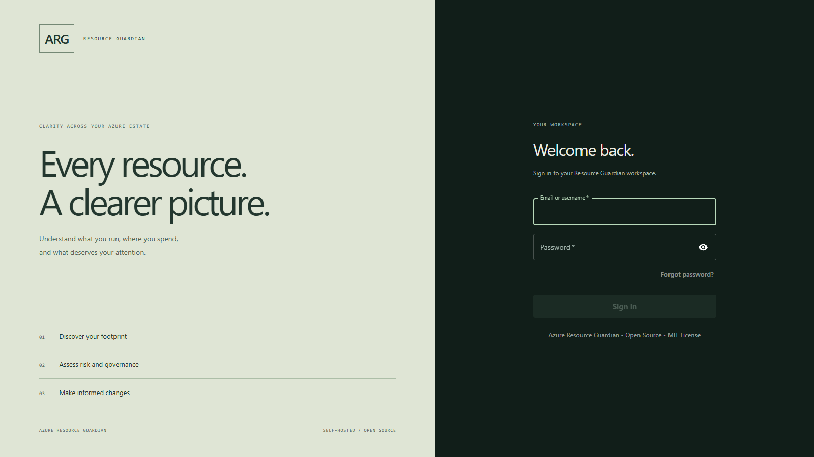
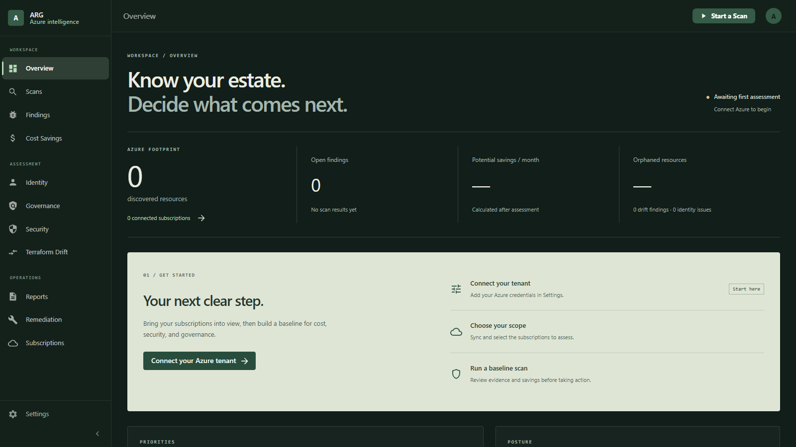
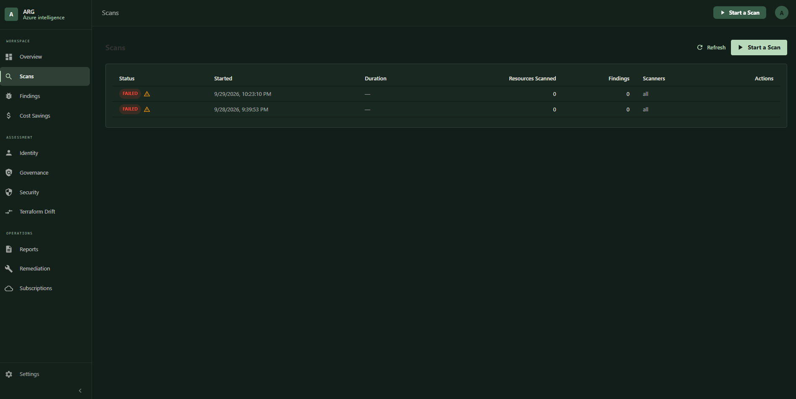
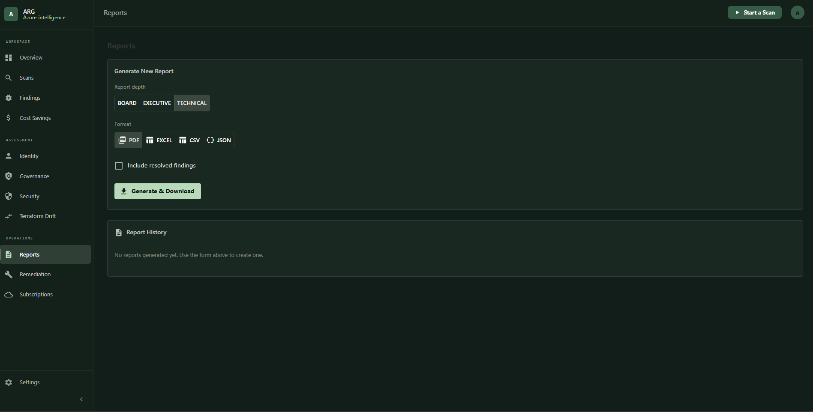
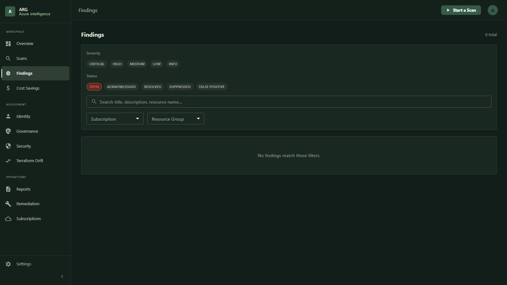
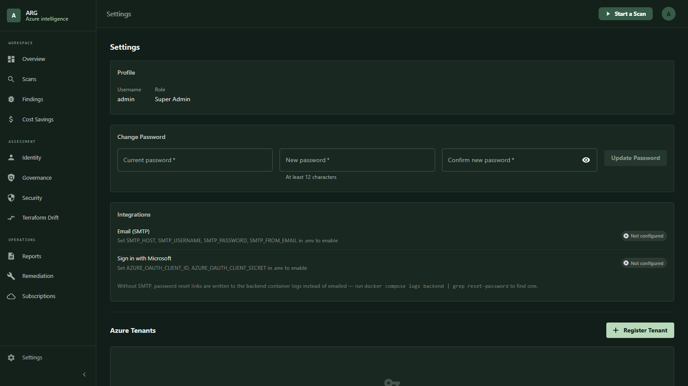

# Azure Resource Guardian (ARG)

> **Discover. Govern. Optimize.**
>
> Author: **Junaid Ahmed** · [jahmed.cloud](https://jahmed.cloud) · [github.com/jahmed-cloud/ARG](https://github.com/jahmed-cloud/ARG)

[](https://opensource.org/licenses/MIT)
[](https://github.com/jahmed-cloud/ARG/releases)
[](https://www.python.org/downloads/)
[](https://fastapi.tiangolo.com)
[](https://reactjs.org)
[](https://www.docker.com)
[](https://hub.docker.com/u/jahmed22)

**Azure Resource Guardian** is a self-hosted, Docker-based, open-source Azure governance platform that gives organizations a single-pane-of-glass view across their entire Azure estate.

---

## Screenshots

| Sign in | Overview |
|---|---|
|  |  |
| **Scans** | **Reports** |
|  |  |
| **Findings** | **Settings** |
|  |  |

---

## Setup and engineering guides

| Goal | Guide |
|---|---|
| Run the local portal or develop the full stack | [Local setup](docs/local-development.md) |
| Connect Azure subscriptions to the Docker stack | [Connect Azure](docs/connect-azure.md) |
| Build, deploy, back up or upgrade containers | [Docker deployment](docs/docker-deployment.md) |
| Understand components and data flow | [Architecture](docs/architecture.md) |
| Review merge decisions and verified behavior | [Merge and validation record](docs/merge-validation.md) |
| Review changes | [Changelog](CHANGELOG.md) |

The local portal uses your `az login` session and needs no database or Docker. The full stack uses React, PostgreSQL, Redis and tenant credentials configured in Settings. Source builds are required to include the latest local changes; published Docker Hub images are separate releases.

## What Problems Does ARG Solve?

| Question | ARG's Answer |
|---|---|
| What resources are costing money unnecessarily? | Cost Optimization Engine with Azure Cost Management integration |
| Which resources are orphaned? | 20+ orphan/idle checks across Compute, Network, Storage, Database, Cost (63 scanners in total - see [docs/scanner-catalog.md](docs/scanner-catalog.md)) |
| Which resources violate governance standards? | Governance Module with CAF + Zero Trust scoring |
| Which Entra ID objects are security risks? | Full Microsoft Graph hygiene analysis |
| What resources are unmanaged by Terraform? | Terraform drift detection engine |
| How much money can we save? | Monthly/annual savings projection per resource |
| What can be safely deleted? | Remediation engine with approval workflows |

---

## Architecture Overview

```
┌─────────────────────────────────────────────────────────────────┐
│                     React Frontend (MUI)                         │
│          Dashboard │ Findings │ Costs │ Identity │ Reports       │
└──────────────────────────┬──────────────────────────────────────┘
                           │ REST API / polling
┌──────────────────────────▼──────────────────────────────────────┐
│                   FastAPI Backend (Python 3.12)                  │
│      Auth │ Scans │ Findings │ Reports │ Remediation │ RBAC      │
└──────┬────────────────────────────────────────┬─────────────────┘
       │                                        │
┌──────▼──────┐                    ┌────────────▼──────────────────┐
│ PostgreSQL  │                    │   Celery Workers + Redis       │
│  Database   │                    │   Scanner Orchestration        │
└─────────────┘                    └────────────┬──────────────────┘
                                                │
                           ┌────────────────────▼──────────────────┐
                           │           Scanner Plugins              │
                           │  Compute │ Network │ Storage │ Identity│
                           │  Governance │ Security │ Terraform     │
                           └────────────────────┬──────────────────┘
                                                │
                           ┌────────────────────▼──────────────────┐
                           │             Azure APIs                  │
                           │  Resource Graph │ Management │ Cost    │
                           │  Microsoft Graph │ Policy              │
                           └───────────────────────────────────────┘
```

---

## Features

### Resource Discovery
- Full Azure resource inventory across subscriptions, management groups, and tenants
- Tag analysis and ownership tracking
- Resource history and change detection

### Orphan Detection (20+ checks)
- Unattached managed disks, old snapshots, deallocated VMs
- Unused public IPs, public IPs held by VM-less NICs, orphaned NICs and NSGs, empty load balancers
- Unused storage accounts (verified against 7-day transaction metrics), orphaned backups
- Idle SQL databases, idle Cosmos DB accounts, idle IoT Hubs, empty resource groups
- DDoS Network Protection plans that protect no VNet or public IP
- Private Link DNS zones with no endpoints

### Cost Optimization
- Azure Cost Management integration
- Per-resource monthly/annual savings estimates
- Top 10 cost-saving opportunities dashboard
- Cost trend analysis
- Previous-generation App Service plans (Premium v2 → v3) and CPU-saturated plans
- Hyperscale databases on the legacy storage meter
- Azure OpenAI / Foundry spend without an AI gateway, and AI account sprawl
- Storage account sprawl and transaction hotspots
- Budgets exceeded month after month, and Advisor reservation / savings-plan opportunities
- Marketplace SaaS plans: unsubscribed leftovers, suspended or never-activated plans, terms ending or auto-renewing

### Entra ID Hygiene
- Stale/unused applications and service principals
- Expired certificates and secrets
- Guest users never logged in, dormant users, MFA gaps
- Permanent Global Admins, PIM assignments never activated
- Managed identities never used

### Governance
- Tag policy enforcement
- Naming standard validation
- Region restriction compliance
- CAF alignment scoring
- Zero Trust alignment scoring
- Governance Score (0-100)
- Environment tag vs name mismatches (e.g. a `-Test` database tagged `prod`) and tag-key typos
- Production and non-production sharing one App Service plan; app and data tiers split across regions
- Log Analytics daily caps that silently drop data, App Insights linked to deleted workspaces, missing Service Health alerts
- Many unrelated workloads sharing one subscription (landing-zone gap)

### Security
- Public storage accounts, SQL servers, Key Vaults
- Disabled Defender plans, low secure score, and imported Defender for Cloud recommendations
- Missing backup configurations
- Expired certificates
- Missing diagnostic settings (verified per resource in live scans)
- RDP/SSH open to the Internet, VM public IPs next to Bastion, end-of-support OS images
- SQL "Allow Azure services" / ad-hoc single-IP firewall rules, Entra-only auth disabled
- Storage shared-key access and open networks; Key Vault access-policy model, soft delete, purge protection
- Azure OpenAI / AI Services key authentication and open networks
- Web apps allowing HTTP, EOL runtimes (.NET, Node, Python, PHP), weak TLS, no managed identity
- Excess subscription Owners, standing User Access Administrator, privileged service principals
- Security Score (0-100)

### Terraform Drift Detection
- Compare Terraform state vs live Azure inventory
- Detect unmanaged resources, deleted resources, config drift
- Generate Terraform import commands
- Generate remediation plans

### Reporting
- Executive PDF summary
- Board-level reports
- Technical CSV/Excel/JSON exports
- Compliance reports

### Subscription Analysis Report (CLI + local portal)
Run every scanner against your subscriptions from your own workstation - **no Docker, database or
service principal needed**. Azure access reuses your **`az login`** session (your own account).
Full guide: [docs/subscription-analysis.md](docs/subscription-analysis.md) · PRD: [docs/PRD-subscription-analysis.md](docs/PRD-subscription-analysis.md) · 
End-to-end runbook (sign in, estate, every subscription, portal, tests): [local-run.md](local-run.md)

**Where to run:** the PowerShell/bash launchers work **from any folder** (they switch to the repo root and
create `.venv-local` on first use). Plain `python -m …` commands must be run **from the ARG repository root**.
Reports always go to **`<ARG repo>/reports/`** unless you pass `-ReportsPath` / `--reports-dir`.

```powershell
az login                                                         # once, in a terminal

# Local portal - http://127.0.0.1:8765
C:\path\to\ARG\scripts\Start-LocalPortal.ps1                     # Linux/macOS: ./scripts/start-local-portal.sh

# Command line - one folder per subscription, plus an index
C:\path\to\ARG\scripts\Invoke-SubscriptionAnalysis.ps1 -Subscription '<subscription-id-or-name>'
C:\path\to\ARG\scripts\Invoke-SubscriptionAnalysis.ps1 -All
```

Python equivalents (from the repo root, after `pip install -r requirements-local.txt`):

```bash
python -m scripts.subscription_analysis --subscription "<subscription-id-or-name>"   # repeatable
python -m scripts.subscription_analysis --all --parallel 3                           # every enabled subscription, 3 at a time
python -m scripts.subscription_analysis --all --estate                               # estate inventory + usage (~4-5 min)
python -m scripts.local_portal                                                       # the portal
# options: --reports-dir DIR  --tenant <id>  --scanners a,b  --config thresholds.json  --skip-cost
```

- **Estate inventory** (portal **Estate** page, `reports/_estate/`): every resource across all subscriptions
  with category, type, **size / SKU** (VM sizes, disk SKUs and GB, storage SKU/kind/tier, App Service plan SKUs,
  SQL/Redis SKUs, AKS pools, Arc SQL editions), configuration, OS and Hybrid Benefit, power state, environment,
  region, cost, the report findings on it, **vCPU / RAM** and **30-day usage** from Azure Monitor (CPU and memory %,
  transactions, requests, connections, messages, runs, calls, tokens, used capacity) with an **idle** flag, for 31
  resource types. CPU and other percentages come with the **busiest hour**, P95 and one-minute bursts, so a 1.5 %
  average and a 100 % portal peak are shown together; idle storage that still holds data is flagged **dormant**, and
  VM right-sizing suggestions are validated against 30 days of CPU, memory, disk and network on the new size
  (Azure Advisor's user-facing limits, applied to every VM) and cross-checked with Advisor. Filter by any of these, click breakdowns
  to drill down, switch to the Suggestions view, export CSV and share filtered links. [docs/subscription-analysis.md §5c](docs/subscription-analysis.md#5c-estate-inventory-all-subscriptions).

- **Portal login** is a simple local username/password that only protects the portal:
  `ARG_PORTAL_USER` (default `admin`) / `ARG_PORTAL_PASSWORD`. If no password is set, a one-time
  password is printed in the terminal at start-up. The portal never signs in to Azure itself.
- It shows which account the `az login` session uses, lists the subscriptions that account can see,
  lets you **Analyze** one or several (progress shown live), and renders every report page (markdown,
  mermaid diagrams, JSON evidence) in the browser. To switch account or tenant, run `az login` again
  and click **Refresh**.
- It listens on localhost only, checks the Host/Origin headers, and neutralises HTML in rendered
  reports.

Both write the same layout:

```
reports/
├── README.md                        # index: one row per analysed subscription
├── _estate/                         # estate inventory across all subscriptions (README.md, estate.json)
└── <subscription-name>/
    ├── README.md                    # executive summary, headline savings, top risks, action list
    ├── summary.json                 # machine-readable totals (used by the index/portal)
    ├── 01-current-findings/         # baseline, workloads, architecture diagram, resource inventory
    ├── 02-gap-analysis/             # gaps by area (structural, security, operations, performance, FinOps)
    ├── 03-cost-drivers/             # 12-month trend, service/RG/resource breakdown, savings register
    ├── 04-architectural-critique/   # inferred evolution, decision-by-decision critique, target, roadmap
    └── 05-deep-dive/                # per-area technical detail + raw JSON evidence
```

Your account needs **Reader**, **Cost Management Reader** and **Security Reader** on each subscription.
Savings estimates are calculated in USD at each resource's own amortized cost, so negotiated discounts,
reservations and savings plans count (list prices only when a resource has no cost data), and shown in the billing
currency at the subscription's implied exchange rate. Re-running a subscription replaces its folder; subscriptions
that share a display name get `<name>_<first 8 of ID>/` so they never overwrite each other.
Reports contain resource IDs and principal IDs - `reports/` is git-ignored. Entra ID (Graph) scanners
are skipped in this mode.

### ARG vs. Azure FinOps hubs

ARG does **not** use or require [FinOps hubs](https://learn.microsoft.com/cloud-computing/finops/toolkit/hubs/finops-hubs-overview)
from the Microsoft FinOps toolkit. It reads cost data **live** at scan time, straight from the Azure APIs:

- **Cost Management Query API** (`Microsoft.CostManagement/query`) - 12-month cost by service, and 30-day
  cost by resource group, meter and resource
- **Consumption Budgets API** (`Microsoft.Consumption/budgets`) - budgets and overspend
- **Azure Retail Prices API** (`prices.azure.com`, public, USD) - list prices, the starting point for savings
  estimates (scaled to each resource's actual cost)
- **Resource Graph** and **Azure Monitor metrics** - inventory and 30-day usage for idle detection

The two tools answer different questions and work well together:

| | Azure FinOps hubs (FinOps toolkit) | ARG |
|---|---|---|
| What it is | A data platform you deploy into Azure (Storage/ADLS, Data Factory, optionally Data Explorer or Fabric, Power BI) | A read-only scanner: local CLI/portal or the Docker stack |
| Cost data | Scheduled Cost Management exports (FOCUS), ingested and retained | Live Cost Management API queries on each run |
| Scope | Billing account / enrollment, across many subscriptions and tenants | One or more subscriptions per run |
| History | As long as you retain it (beyond the 13-month API window) | About 12 months, as returned by the API at run time |
| Output | Dashboards and KQL/Power BI analytics: trends, showback/chargeback, commitment utilisation | Actionable findings (`F-nnn`) with CLI remediation, savings estimates, security and architecture review |
| Running cost | Ongoing Azure spend (storage, ADF, ADX/Fabric) and upkeep | None beyond API calls |

**Where ARG adds value:** FinOps hubs show *where the money goes over time*; ARG ties the cost of each
resource to *what it is actually doing* (30-day metrics such as storage transactions, SQL CPU/DTU and
connections, IoT devices/messages, backup protected items) and adds security and architecture findings,
so the output is a concrete action list per subscription.

**What ARG does not do:** long-term cost history, the FOCUS schema, enterprise-wide showback/chargeback
or Power BI reporting - use FinOps hubs for those. A possible future integration is reading costs from a
hub's Data Explorer / FOCUS exports when one exists, and falling back to the live API otherwise.

---

## Docker Hub Images

**ARG 0.2** is published to Docker Hub as multi-arch images (`linux/amd64` + `linux/arm64`):

| Image | Tags |
|-------|------|
| `jahmed22/azure-resource-guardian-backend` | `0.2`, `0.1`, `latest` |
| `jahmed22/azure-resource-guardian-worker` | `0.2`, `0.1`, `latest` |
| `jahmed22/azure-resource-guardian-frontend` | `0.2`, `0.1`, `latest` |

### Run directly from Docker Hub (no source code needed)

```bash
# Download just the compose file and .env template
curl -O https://raw.githubusercontent.com/jahmed-cloud/ARG/main/docker-compose.hub.yml
curl -O https://raw.githubusercontent.com/jahmed-cloud/ARG/main/.env.example

# Configure
cp .env.example .env
nano .env   # set POSTGRES_PASSWORD, SECRET_KEY, ENCRYPTION_KEY, ADMIN_PASSWORD

# Start
docker compose -f docker-compose.hub.yml up -d

# UI → http://localhost:3000
# Log in with the ADMIN_EMAIL / ADMIN_PASSWORD you set in .env
# The admin account is created automatically on first startup - no manual command needed.
```

### Pull a specific version

```bash
docker pull jahmed22/azure-resource-guardian-backend:0.2
docker pull jahmed22/azure-resource-guardian-worker:0.2
docker pull jahmed22/azure-resource-guardian-frontend:0.2
```

---

## Quick Start

### Prerequisites
- Docker Engine 24+ and the Docker Compose plugin
- Azure Service Principal with Reader + Cost Management Reader roles
- (Optional) Microsoft Graph API permissions for Entra ID module

#### Installing Docker on Ubuntu

If Docker isn't already installed:

```bash
# Remove any old/conflicting packages first
sudo apt-get remove docker docker-engine docker.io containerd runc

# Install via the official Docker apt repository
sudo apt-get update
sudo apt-get install -y ca-certificates curl gnupg
sudo install -m 0755 -d /etc/apt/keyrings
curl -fsSL https://download.docker.com/linux/ubuntu/gpg | sudo gpg --dearmor -o /etc/apt/keyrings/docker.gpg
sudo chmod a+r /etc/apt/keyrings/docker.gpg

echo \
  "deb [arch=$(dpkg --print-architecture) signed-by=/etc/apt/keyrings/docker.gpg] https://download.docker.com/linux/ubuntu \
  $(. /etc/os-release && echo "$VERSION_CODENAME") stable" | \
  sudo tee /etc/apt/sources.list.d/docker.list > /dev/null

sudo apt-get update
sudo apt-get install -y docker-ce docker-ce-cli containerd.io docker-buildx-plugin docker-compose-plugin
```

**Permissions:** by default only `root` can run Docker commands. Running every command with `sudo` works, but the more common approach is to add your user to the `docker` group so you don't need `sudo` for every command:

```bash
sudo usermod -aG docker $USER
newgrp docker          # or log out and back in for the group change to take effect
docker run hello-world # verify it works without sudo
```

Be aware that membership in the `docker` group is effectively root-equivalent on the host (containers can mount the host filesystem), so only add trusted users to it.

If you'd rather not modify group membership, just prefix every `docker compose` command below with `sudo`.

### 1. Clone the repository

```bash
git clone https://github.com/jahmed-cloud/ARG.git
cd ARG
```

### 2. Configure environment

The quickest way: generate a `.env` with fresh random values for `POSTGRES_PASSWORD`, `SECRET_KEY`,
`ENCRYPTION_KEY` and `ADMIN_PASSWORD` (it never overwrites an existing `.env`):

```bash
python -m scripts.configure_env          # add --local for host PostgreSQL / Redis development
```

Or by hand:

```bash
cp .env.example .env
nano .env   # set POSTGRES_PASSWORD, SECRET_KEY, ENCRYPTION_KEY, ADMIN_PASSWORD at minimum
```

Generate secure values for the two secret keys rather than leaving the placeholders:

```bash
python3 -c "import secrets; print(secrets.token_hex(32))"   # -> SECRET_KEY
python3 -c "import secrets, base64; print(base64.b64encode(secrets.token_bytes(32)).decode())"  # -> ENCRYPTION_KEY
```

### 3. Build and start the stack

```bash
docker compose up -d --build
```

This builds the backend, worker, beat, and frontend images, then starts Postgres, Redis, and all four application services. The backend container automatically runs `alembic upgrade head` on startup, so the database schema is created the first time it boots - no manual migration step needed.

Windows with Podman Desktop instead of Docker: `.\scripts\Start-PodmanStack.ps1` builds and starts the same stack (see [local-run.md](local-run.md), section 8).

Check that everything came up healthy:

```bash
docker compose ps
docker compose logs -f backend   # watch startup logs; Ctrl+C to stop tailing
```

### 4. Access the dashboard

```
http://localhost:3000
```

Log in with the `ADMIN_EMAIL` and `ADMIN_PASSWORD` you set in `.env`.
The admin account is **created automatically on first startup** - no manual command needed.

#### Default sign-in

| Where | Username | Password |
|---|---|---|
| Docker UI (`http://localhost:3000`) | `admin` (or `admin@local.dev`) - `ADMIN_USERNAME` / `ADMIN_EMAIL` | `ADMIN_PASSWORD` in `.env`, generated by `scripts.configure_env` |
| Local portal (`http://127.0.0.1:8765`) | `admin` - `ARG_PORTAL_USER` | `ARG_PORTAL_PASSWORD`, or a one-time password printed at start-up |

There is no shared built-in password: every installation generates its own. The backend syncs the admin
password from `ADMIN_PASSWORD` on each start, so to set a new one:

```bash
python -m scripts.configure_env --rotate-admin   # writes a new ADMIN_PASSWORD to .env and prints it
docker compose up -d backend                     # restart the backend to apply it
```

`.env` is the source of truth for the admin account: a password changed under **Settings - Change Password** is
reset to `ADMIN_PASSWORD` the next time the backend starts, so change the admin password in `.env` instead. Keep
`.env` private.

The backend API and interactive docs are available directly at `http://localhost:8000/docs` if you want to explore or test endpoints outside the UI.

### 5. Connect Azure

```bash
az login
python -m scripts.connect_azure --scan
```

See [Connect your Azure subscription](#connect-your-azure-subscription) for what it does and the manual steps.

### Stopping / resetting

```bash
docker compose down          # stop containers, keep data
docker compose down -v       # stop containers AND delete all data (database, Redis, reports and Beat volumes)
```

---

## Azure Permissions Required

| Module | Required Role |
|---|---|
| Resource Discovery | Reader |
| Cost Analysis | Cost Management Reader |
| Entra ID Hygiene | Global Reader (Graph API) |
| Policy Compliance | Reader |
| Security | Security Reader |
| Metrics, diagnostic settings, SQL firewall rules, site config (posture scanners) | Reader |

These are **Azure AD / Azure RBAC roles** assigned to the Service Principal you register in ARG's Settings page - separate from the Linux/Docker permissions discussed above. To create the Service Principal and assign Reader access:

```bash
az ad sp create-for-rbac --name "arg-scanner" --role Reader --scopes /subscriptions/<subscription-id>
```

This prints a `appId` (client ID) and `password` (client secret) - enter those along with your Azure AD tenant ID into ARG's Settings → Azure Tenants page after logging in. The secret is encrypted with AES-256-GCM before being stored.

### Connect your Azure subscription

A scan needs a registered tenant **and** at least one registered subscription; without them every scan fails with
"No active subscriptions found for scan". Full guide: [docs/connect-azure.md](docs/connect-azure.md).

**Option A - one command** (as simple as the local scanner: sign in, run one command):

```bash
az login
python -m scripts.connect_azure                                   # every enabled subscription in the tenant
python -m scripts.connect_azure --subscription <subscription-id>  # or only these (repeat the flag)
python -m scripts.connect_azure --scan                            # connect and start a scan
```

It uses your `az login` to create (or reuse) the read-only service principal `arg-scanner`, assigns Reader, Cost
Management Reader and Security Reader on each subscription, and registers the tenant and subscriptions in ARG with
`ADMIN_USERNAME` / `ADMIN_PASSWORD` from `.env`. The client secret goes straight from Azure into ARG (encrypted)
and is never printed. Run it again to add subscriptions; `--new-secret` replaces an expiring secret.

**Option B - manual:**

1. `az ad sp create-for-rbac --name "arg-scanner" --role Reader --scopes /subscriptions/<subscription-id>` - note
   `appId`, `password` and `tenant`.
2. Add `Cost Management Reader` and `Security Reader`:
   `az role assignment create --assignee <appId> --role "<role>" --scope /subscriptions/<subscription-id>`.
3. Optional, identity scanners: Microsoft Graph **Application** permissions `User.Read.All`, `AuditLog.Read.All`,
   `Reports.Read.All`, `RoleManagement.Read.Directory`, `Application.Read.All`, then **Grant admin consent**.
4. Settings - **Register Tenant**: tenant ID, client ID (`appId`), client secret (`password`).
5. Subscriptions - **Register Subscription**: subscription ID and the tenant.
6. Scans - **Start a Scan**.

All access is read-only. Remediation scripts are generated for review and never run against Azure by ARG.

---

## Project Structure

```
arg/
├── frontend/          # React + TypeScript + Material UI
├── backend/           # FastAPI + Python 3.12
├── workers/           # Celery worker definitions
├── scanners/          # Plugin-based scanner framework
│   ├── base/          # BaseScanner, PostureScanner, shared Azure API helpers
│   ├── compute/       # VM, disk, snapshot, App Service scanners
│   ├── network/       # IP, NIC, LB, NSG, DDoS, DNS scanners
│   ├── storage/       # Storage account scanners
│   ├── database/      # SQL, Hyperscale, Cosmos DB scanners
│   ├── cost/          # IoT, AI spend, commitment-discount scanners
│   ├── identity/      # Entra ID scanners
│   ├── governance/    # Tags, naming, policy, observability, budget scanners
│   ├── security/      # Security posture, Defender, RBAC scanners
│   └── terraform/     # Drift detection scanners
├── reports/           # Generated local reports (ignored by Git)
├── docs/              # User guide, PRD, scanner catalog (docs/README.md)
├── scripts/           # subscription_analysis CLI, local_portal, launchers (*.ps1, *.sh)
├── docker/            # Dockerfiles
└── tests/             # Offline scanner, report, portal and configuration tests
```

---

## Development

Follow [Local setup](docs/local-development.md) for virtual environments, database/Redis configuration, migrations and worker commands. Run Python modules from the repository root.

```bash
python -m pytest tests -q
python -m uvicorn backend.main:app --reload
# In another terminal:
cd frontend
npm ci
npm run dev
```

For a new configuration, `python -m scripts.configure_env` generates unique credentials without overwriting an existing `.env`. Use `--local` for host database/Redis URLs. See the [Docker guide](docs/docker-deployment.md) for production overrides and upgrade handling.

---

## Contributing

Contributions are welcome - bug reports, scanner additions, and pull requests all help.

1. Fork the repo and create a feature branch off `main`
2. Keep changes focused - one feature or fix per PR makes review much faster
3. Test against a real `docker compose up --build` before opening a PR, not just `import` checks
4. Open a PR describing what changed and why

If you're adding a new scanner, follow the existing pattern in `scanners/` (subclass `BaseScanner`, register via `@register_scanner`, and provide a mock-data fallback so the scanner is testable without live Azure credentials).

For bugs or feature requests, open an issue on [GitHub](https://github.com/jahmed-cloud/ARG/issues).

---

## License

MIT License - see [LICENSE](LICENSE) for details.

---

## Roadmap

See [ROADMAP.md](ROADMAP.md) for what's planned next.

---

## About / Author

Azure Resource Guardian was designed and built by **Junaid Ahmed**.

- Website: [jahmed.cloud](https://jahmed.cloud)
- GitHub: [github.com/jahmed-cloud](https://github.com/jahmed-cloud) · [ARG repository](https://github.com/jahmed-cloud/ARG)
- Docker Hub: [hub.docker.com/repositories/jahmed22](https://hub.docker.com/repositories/jahmed22)
- Email: [iam@jahmed.cloud](mailto:iam@jahmed.cloud)

This same information is also available in-app under **Settings → About**.

---

*Built for Azure engineers who want real visibility into their cloud estate without paying for another SaaS subscription.*
