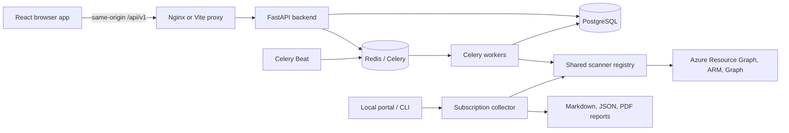

# Architecture

ARG has two execution modes sharing the scanner framework. They have separate authentication, storage, and job orchestration; the local portal is not a frontend for the PostgreSQL deployment.

## Full stack

| Layer | Implementation | Responsibility |
|---|---|---|
| UI | React 18, TypeScript, MUI, Redux, Vite | Authenticated dashboard, scans, findings, costs, identity, governance, drift, security, reports, remediation, subscriptions, settings |
| HTTP | FastAPI, Pydantic | Validation, JWT authentication, role checks, API routing under `/api/v1` |
| Data | PostgreSQL 16, SQLAlchemy, Alembic | Tenants, encrypted credentials, inventory, findings, scan history, users and governance settings |
| Background work | Celery worker and Beat, Redis 7 | Scan execution and periodic tasks; workers consume `celery,scans,scanners,reports` |
| Scanners | Registry of `BaseScanner` / `PostureScanner` subclasses | Resource detection, evidence, cost enrichment and suggested remediation |
| Reports | Backend report routes/services | Generate files and store their metadata in PostgreSQL |

The browser uses a relative `/api/v1` URL by default. Vite forwards it during development; Nginx forwards it in containers. `VITE_API_URL` remains a build-time override. Auth state survives page reloads in browser storage; backend authorization remains authoritative. Progress and dashboard updates use HTTP polling, not a WebSocket service.

Pages load on demand through React `lazy` and `Suspense`. Route error boundaries offer reload recovery after failed chunk downloads. The persistent shell retains navigation while authenticated pages load. MUI, React and chart bundles retain vendor caching; chart code is deferred until a chart page is needed. Dashboard polling permits one request at a time and cancels requests on unmount. Background failures retain the last successful data with a visible warning.

The mobile shell switches to an overlay below 900px. It reserves no sidebar width and always shows full navigation labels, even after the desktop sidebar was collapsed. Shared styles provide keyboard focus, reduced-motion support, and horizontal scrolling for wide tables.

## Local portal and CLI

Access is role-based with a per-subscription scope for viewers: `backend/services/access.py` turns the caller into an `AccessScope` that every read route applies to its `subscription_id` column; Entra group roles, Azure Owner leases and ARG reader grants are described in [Access control](access-control.md).

The worker authenticates per tenant with the stored service principal (`ClientSecretCredential`); `scripts.connect_azure` creates that principal from the operator's `az login` and registers it through the API, and the secret can be replaced in place with `PATCH /tenants/{id}`.

`scripts.subscription_analysis` uses the Azure CLI credential from `az login`. It collects paginated inventory, runs scanners and writes subscription-specific files under `reports/`. The local FastAPI/Jinja portal adds a loopback web UI and a bounded thread pool for analyses. It does not require PostgreSQL, Redis, Docker, or the React build.

Local portal sessions are in memory, use HttpOnly/SameSite cookies, and reset when the process restarts. Host/origin guards and report path containment remain in place. The portal password does not authenticate to Azure. Login throttling runs in a thread so it does not block the async server. Subscription filtering and selection run in the browser; job status polling prevents overlapping requests and reports connection failures inline.

The portal overview counts visible subscriptions, enabled subscriptions and saved report summaries. It does not invent aggregate cost values across currencies. Tables remain scrollable within their cards on narrow screens. Report/PDF export and print routes are preserved.

The Estate page combines cross-subscription inventory, per-type configuration, compute sizing and usage metrics for 31 resource types with saved findings/cost data. Its compact JSON and markdown snapshot live under `reports/_estate/`. The CLI supports `--parallel` and `--estate`. The portal serializes refresh admission so simultaneous requests do not start duplicate Azure metric collections. Estate filters, sorting, CSV downloads and keyboard detail expansion operate on the browser snapshot; usage semantics remain those in the upstream collector.

## Containers and persistence

Python images use a builder virtual environment copied into a non-root runtime; compiler packages stay in the builder. Dependency manifests precede source copies. BuildKit caches downloaded pip/npm packages, and the frontend uses the committed lockfile with `npm ci`. A failed lockfile check stops the build.

The backend entrypoint runs migrations, seeds the initial admin idempotently, then uses `exec` to start Uvicorn. Worker, Beat and frontend startup wait for backend readiness. `/api/v1/health/live` checks process liveness; `/api/v1/health` checks the database and returns HTTP 503 on failure. SQLAlchemy checks pooled connections before reuse.

Named volumes store PostgreSQL data, Redis data, backend report files and the Beat schedule. The local portal stores files directly on the host. A report volume must be backed up with its matching database records. Existing deployments need to copy old backend report files before recreating containers; see [deployment](docker-deployment.md).

## Boundaries and tradeoffs

- Existing scanner algorithms, database schema and authentication flows are preserved. Readiness intentionally changes its failure HTTP status; one existing migration gains offline SQL generation support without changing its online behavior.
- Upstream Azure pagination, concurrent ARM calls, caching, governance configuration and remediation script fields are retained.
- Python direct dependencies remain pinned; transitive dependencies are not fully locked. Major dependency upgrades and a full vulnerability audit are separate work.
- The default production overlay is a single-host starting point. It does not add TLS termination, high availability, distributed file storage, or Kubernetes support.
- Only one backend migration owner and one Beat scheduler should run during startup. Horizontal API scaling needs an explicit migration job and shared report storage.
- Offline scanner fixtures and browser fixtures cannot prove behavior against a particular Azure tenant. The [validation record](merge-validation.md) distinguishes verified behavior from deployment checks still required.
